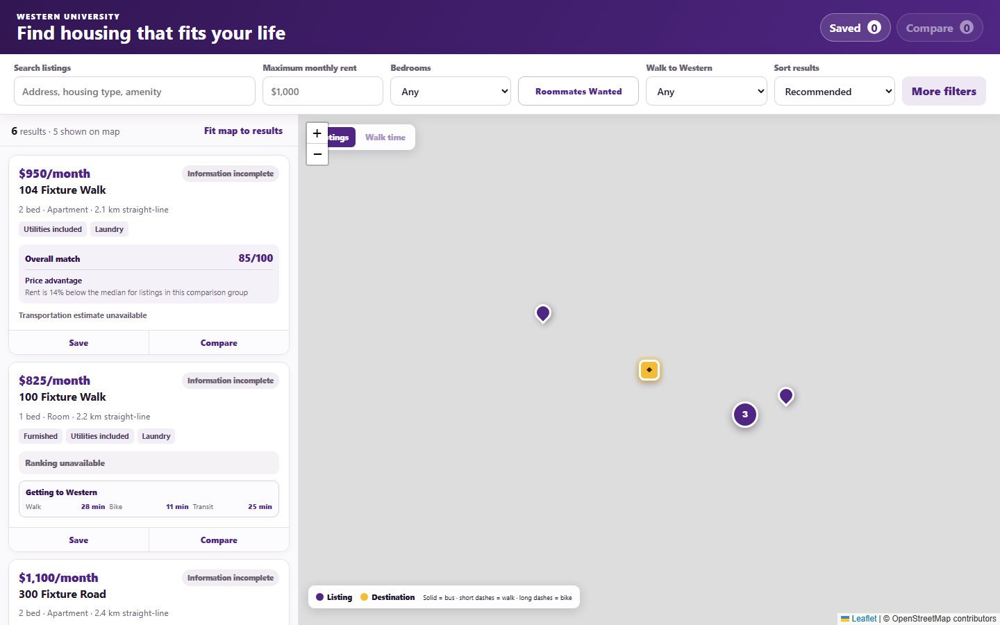
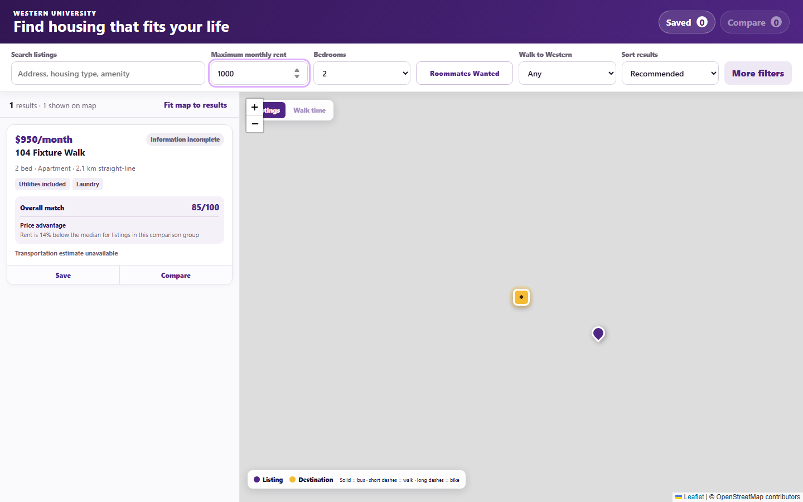
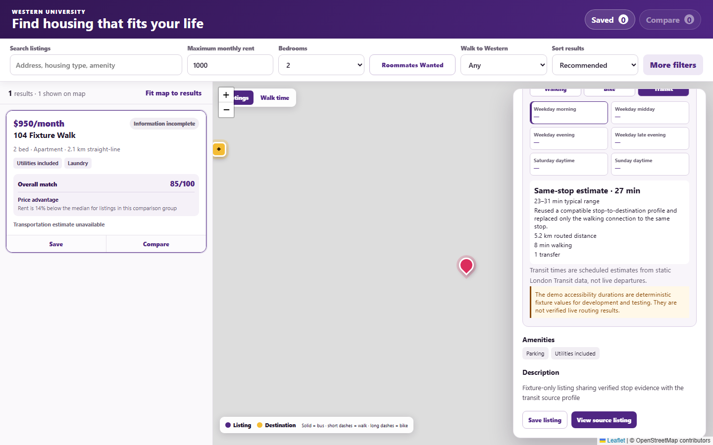
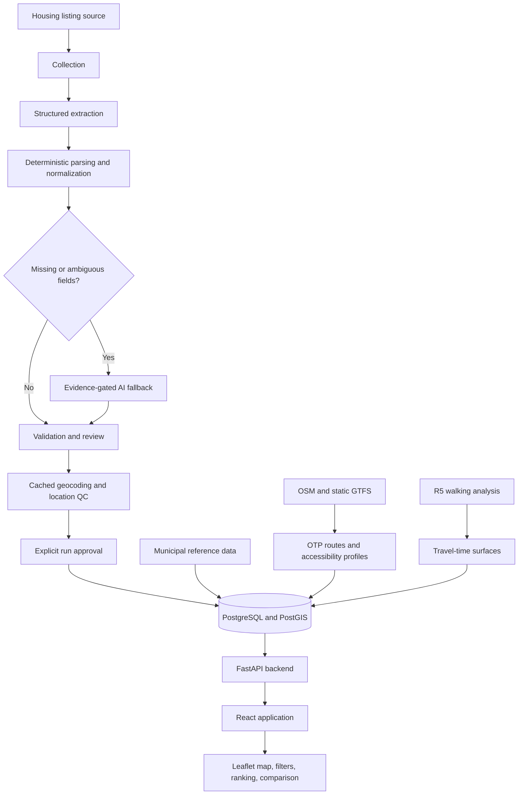

# UWO Housing Intelligence Platform

A full-stack prototype that turns semi-structured student rental listings into auditable, map-based housing comparisons with price, location, and transportation context.

> **Independent student project. Not affiliated with, commissioned by, or endorsed by Western University.**

## Screenshots

All screenshots use the repository's synthetic accessibility fixture. Reproduction steps are in [docs/images/README.md](docs/images/README.md).

### Product overview



### Filtered search



### Listing and transit intelligence



## Core Technologies

React 19 · Vite 8 · Leaflet · FastAPI · Python · pandas · PostgreSQL/PostGIS · OpenTripPlanner · R5 · Docker Compose

## Implemented Capabilities

- Interactive listing map with server-side filters, pagination, URL-persisted search, shortlisting, and comparison.
- Staged ingestion with structured extraction, monthly price normalization, conservative lease/sublet rules, and field-level provenance.
- Evidence-gated local AI fallback only for fields left missing or ambiguous after deterministic parsing.
- Auditable run manifests, review queues, approval fingerprints, dry-run import plans, and immutable listing observations.
- Cached geocoding and location-quality controls that can suppress unsafe markers and routing actions.
- Versioned, explainable price/accessibility ranking plus persisted OTP transit profiles and R5 walking surfaces.
- Repository-neutral FastAPI endpoints backed by fixtures or PostgreSQL, with extensive offline and opt-in integration tests.

Optional infrastructure and generated datasets are required for some routing and database workflows. This repository is a prototype source release, not a hosted production service.

## Architecture



See [docs/architecture.md](docs/architecture.md) for component boundaries and [docs/data-pipeline.md](docs/data-pipeline.md) for ingestion semantics.

## Data Reliability

The pipeline applies a strict evidence hierarchy:

1. structured source fields;
2. deterministic parsing of captured listing text;
3. AI inference only for missing or ambiguous values.

Weaker evidence cannot overwrite stronger evidence. Original price text and source fields remain available for audit, while comparable rent is normalized to a monthly value. A May–August range indicates summer availability; it does **not** make a listing a sublet. The system sets `is_sublet=true` only when explicit sublet, sublease, lease-transfer, or equivalent takeover evidence is present.

## Project Structure

```text
backend/                 FastAPI application, repositories, ranking, history, and mobility
pipeline/                Parsing, optional AI fallback, geocoding, review, approval, and import
scraper/                 Listing URL collection boundary
frontend/                React/Leaflet application and frontend unit tests
supabase/migrations/     Versioned PostgreSQL/PostGIS schema migrations
scripts/                 Development, operator, import, validation, ranking, and routing tools
tests/                   Offline and opt-in integration test suites
config/                  Safe example policies and local configuration templates
docker/                  PostgreSQL and routing container definitions
docs/                    Architecture, data contracts, and subsystem guides
data/samples/            Three synthetic demonstration listings
```

The existing module layout is preserved so imports, PowerShell tooling, tests, and migration references remain valid. Routing spans `backend/`, `pipeline/`, `scripts/`, and `docker/` rather than being duplicated into a cosmetic directory.

## Local Development

The validated local environment used Python 3.13 and Node.js 24. Vite 8 supports Node.js 20.19+ or 22.12+.

Create the Python environment:

```powershell
py -3.13 -m venv .venv
.\.venv\Scripts\python.exe -m pip install --upgrade pip
.\.venv\Scripts\python.exe -m pip install -r requirements-dev.txt
```

Install the frontend:

```powershell
Set-Location frontend
npm ci
Set-Location ..
```

Run the API without a database or external provider:

```powershell
$env:HOUSING_FIXTURE_CSV = 'data/samples/listings.demo.csv'
.\.venv\Scripts\python.exe -m uvicorn backend.main:app --reload --port 8000
```

In a second terminal:

```powershell
Set-Location frontend
npm run dev
```

Vite proxies `/api` to `http://127.0.0.1:8000`. The sample supports discovery and map UI development; persisted accessibility, exact routing, and history require their optional fixtures or local services.

For PostgreSQL-backed development, install `requirements-database.txt`, create `config/local-dev.env` from its example, and follow [docs/local-development.md](docs/local-development.md). Routing requires ignored, separately sourced OSM/GTFS/graph artifacts described in [docs/routing-data.md](docs/routing-data.md).

Do not run collection, hosted geocoding, database import, or AI enrichment without separately reviewing authorization, source terms, credentials, cost, and data-handling requirements.

## Testing

Offline Python suite:

```powershell
.\.venv\Scripts\python.exe -m pytest -m 'not postgres and not r5 and not e2e'
```

Frontend unit tests:

```powershell
Set-Location frontend
npm test
```

`scripts/test.ps1 normal` runs the offline Python suite, compilation, frontend tests, and diff checks. `full` additionally uses disposable PostgreSQL infrastructure and runs frontend lint/build. Tests marked `postgres`, `r5`, or `e2e` require the documented optional local services and datasets.

## Engineering Highlights

- Deterministic extraction and provenance rules take precedence over unconstrained AI output.
- Normalized property/listing identities support deduplication, immutable observations, removals, and relisting.
- Geocode caching, quality review, and fail-closed location visibility reduce unsafe map output.
- Ranking and accessibility calculations are versioned, persisted, and reused only when their inputs remain compatible.
- Repository/provider interfaces keep the application independent from the collection implementation.

## Project Status

Independent student project. Not affiliated with, commissioned by, or endorsed by Western University.

The prototype was presented to Western University Housing. During the discussion, several concepts in the prototype were noted as similar to functionality Western had independently identified through student feedback and communicated to its website vendor.

This statement does not indicate approval, partnership, adoption, commissioning, or endorsement.

Current limitations include the absence of an authorized production listing feed, hosted deployment, live transit data, user accounts, alerts, and an enabled POI/amenity ranking component. Static routing inputs and generated datasets are intentionally excluded.

## Responsible Use

Collection code is included to demonstrate the ingestion boundary, but no scraped housing dataset is distributed. Before using it against any website, confirm authorization, terms of use, rate limits, privacy requirements, and redistribution rights. Never commit credentials or generated listing data.

## License

Released under the [MIT License](LICENSE).
