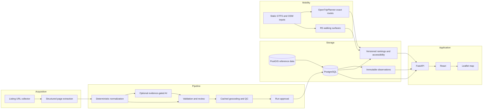

# System Architecture

## System at a Glance

The project separates data acquisition from the product that consumes the resulting structured data. The frontend never imports or invokes the scraper. Database repositories and routing-provider interfaces isolate the API from particular infrastructure choices.



## Component Responsibilities

| Component | Responsibility |
| --- | --- |
| `scraper/` | Enumerate source listing URLs. Its output is an input artifact, not a frontend dependency. |
| `pipeline/` | Extract fields, normalize evidence, optionally enrich unresolved values, geocode, create review artifacts, approve runs, and plan/import database changes. |
| `supabase/migrations/` | Define the PostgreSQL/PostGIS model for runs, geocodes, properties, listings, observations, reviews, rankings, accessibility, travel-time surfaces, and reference data. |
| `backend/` | Expose listing discovery and intelligence through repository- and provider-neutral FastAPI services. |
| `frontend/` | Render search, comparison, explainable scores, transportation context, history, and map interaction. |
| `scripts/` | Provide deliberate operator entry points for local services, validation, imports, ranking, routing, and quality review. |
| `docker/` and Compose files | Define local PostgreSQL and routing services. Generated routing inputs remain outside Git. |
| `tests/` | Cover deterministic rules and application behavior, with marked opt-in suites for PostgreSQL, R5, and browser integration. |

## Runtime Paths

### Offline demonstration

```text
Synthetic CSV -> Fixture repository -> FastAPI -> Vite proxy -> React/Leaflet
```

This path needs no credentials, database, scraper, geocoder, AI service, or routing engine.

### Reviewed data import

```text
Captured source -> Stage 0-3 run -> review queue -> explicit approval
-> dry-run import plan -> transactional PostgreSQL import -> API
```

Every run has a manifest and artifact identities. Database import remains outside the collection orchestrator so a scrape cannot implicitly publish data.

### Mobility intelligence

```text
Reviewed property coordinates + versioned OSM/GTFS bundle
-> bounded worker -> quality assessment -> persisted profiles/surfaces
-> API filters and detail responses
```

Interactive filtering reads persisted accessibility results. Exact route requests are separate and explicit, avoiding expensive provider calls during normal search.

## Major Design Decisions

- **Evidence is ordered.** Structured source fields outrank deterministic text parsing; AI can fill only unresolved or ambiguous values.
- **Unknown is not false.** Nullable states are preserved rather than turning missing data into negative facts or zero travel times.
- **Publication is gated.** Validation, human-review artifacts, approval fingerprints, and database dry runs separate collection from persistence.
- **Location fails closed.** Low-confidence or unsafe coordinates can remain searchable while map markers and route actions are suppressed.
- **Expensive work is cached and versioned.** Geocodes, accessibility profiles, ranking inputs, provider versions, schedules, networks, and expirations are part of reuse decisions.
- **History is immutable.** Stable listing identity is separated from observations so changes, removals, and relisting can be represented without rewriting history.
- **Providers are replaceable.** Fixture, PostgreSQL/Supabase-compatible, OpenTripPlanner, and R5-backed implementations sit behind repository or provider boundaries.

## Infrastructure Boundary

The source tree contains code and safe configuration examples only. A working full stack additionally needs local credentials, a PostgreSQL instance, and separately sourced routing artifacts. Those files are ignored and are not part of the public-safe sample. No hosted deployment or authorized production listing feed is included.
